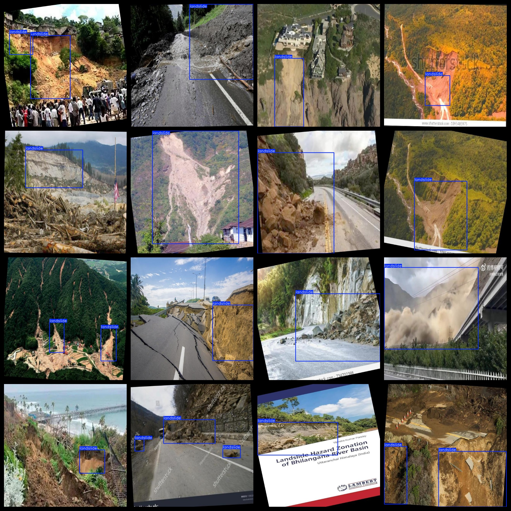

# Landslide Dataset 6709 imagesVOC+YOLO format（(Augmented) ）

The slope dataset contains 6709 VOC+YOLO format (enhanced) images.

Dataset format: Pascal VOC format + YOLO format (the txt file does not contain the split path, it only contains jpg images and corresponding VOC format xml files and yolo format txt files)

Image count (number of jpg files): 6709

Number of xml files: 6709

Number of files: 6709

Number of categories: 1

The Github repository is: datasets_sl

Annotation class names: ["landslide"]

Number of boxes labeled in each category:

The number of landslides is 8085.

Total Frames: 8085

Number of images per category:

Landslides occupying images = 6709

Image resolution: 640x640

Use the labeling tool: labelImg

Dataset Augmentation: Yes

Rules for annotation: Draw a rectangle around the category.

Important note: The dataset does not have been divided into training, validation, and testing sets.

Special Disclaimer: This dataset does not guarantee the accuracy of the trained models or weight files.

Annotation and image details are as follows:

## Images

---

Here is a pay link on Stripe (https://buy.stripe.com/3cs8yP7sY87d0vu9AB). Please contact me lonlonago@foxmail.com after funding $89, and I will send you a complete data files, thank you!

